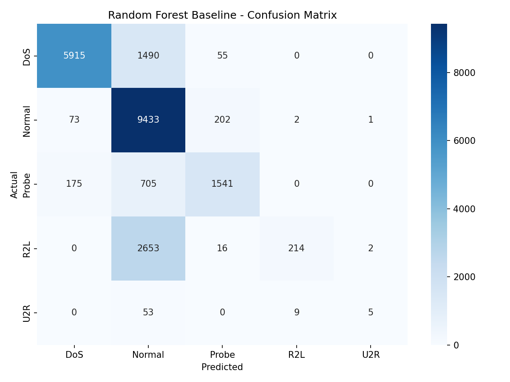

**Course:** Advanced Python (ICS0019) 

**Team members:** Sharlotte Lim, Hülya Ayça Önerge 

**Date:** 25/05/2026 

**Repository link:** https://github.com/crematedingmt/network-intrusion-detection 

## **1. Approach** 

## **1.1. Strategy Overview** 

Our strategy when starting this project was to learn and figure out how we wanted to handle the model as we moved on. 

## **1.2. Preprocessing** 

Describe any changes you made to the data beyond the starter code: 

- Feature engineering: No additional features were created. The provided NSL-KDD features were used. 

- Feature selection: The `level` and `num_outbound_cmds` columns were removed because they were not useful model features. 

- Scaling: None 

- Other: For experiment 3 & 4, SMOTE was applied to balance the class imbalance. 

## **1.3. Class Imbalance Handling** 

How did you address the imbalance between classes? 

- Method used: SMOTE, class_weight, combination 

- Parameters: class_weight='balanced', SMOTE 

- Scaling: None 

- Effect on training set distribution: The training dataset was highly imbalanced, with Normal and DoS traffic containing a lot more samples than R2L and U2R. After using SMOTE, however, R2L and U2R were oversampled for a better class distribution. 

## **2. Experiments** 

Always document experiments you run. Fill in the summary table with all the experiments. Add the descriptions for the ones you find important. 

## **Total number of experiments:** 6 

## **Experiment 1: Baseline Random Forest** 

- **Algorithm:** Random Forest Classifier 

- **What changed from baseline:** Added cross-validation + confusion matrix. 

- **Macro F1 (CV):** 0.9201 (SD: 0.0212) 

- **Macro F1 (test):** 0.5009 

- **Observation:** The baseline Random Forest model performed  well on the majority classes (DoS, Normal, and Probe), achieving high F1-scores for those categories. However, performance on the minority classes R2L and U2R was very poor due to severe class imbalance in the dataset. The confusion matrix showed that many R2L and U2R samples were incorrectly classified as Normal or DoS. Despite this limitation, the model achieved a macro F1-score higher than the assignment baseline (~0.47), providing a solid starting point for further experiments. 

## **Experiment 2: Weighted-Class Random Forest** 

- **Algorithm:** Random Forest Classifier 

- **What changed:** Added RandomForestClassifier(class_weight=’balanced’) 

- **Macro F1 (CV):** 0.9221 (SD: 0.0156) 

- **Macro F1 (test):** 0.4779 

- **Observation:** Although experiment 2’s cross-validation score still came out relatively high, it gave a worse performance than the baseline model. R2L recall seems to have hit rock bottom, and the other classifications gave an overall poorer scores for the classifications. Adding weights alone is not enough for the class imbalance problem. 

## **Experiment 3: SMOTE + Random Forest** 

- **Algorithm:** Random Forest Classifier 

- **What changed:** Added SMOTE before training for better  class distribution. 

- **Macro F1 (CV):** 0.9997 (SD: 0.0001) 

- **Macro F1 (test):** 0.5351 

- **Observation:** Macro F1 score has increased compared to the other 2 experiments. Precision and recall have gone up noticeably for R2L and U2R. The model seems to be learning patterns from the rare attack categories. Another important thing to mention is how high the cross-validation score has reached from SMOTE. Overfitting might be the case here due to the gap between the CV Macro F1 score and the Macro F1 test score. 

## **Experiment 4: SMOTE + Class Weight Random Forest** 

- **Algorithm:** Random Forest Classifier 

- **What changed:** Added SMOTE and class weight together. 

- **Macro F1 (CV):** 0.9997 (SD: 0.0001) 

- **Macro F1 (test):** 0.5351 

- **Observation:** Nothing changed when class weight was added back. It seems the parameters together do not improve anything. The improvement of the score from experiment 3 was solely from SMOTE. 

## **Experiment 5: XGBoost + SMOTE** 

- **Algorithm:** XGBoost Classifier 

- **What changed:** Replaced the Random Forest model with XGBoost and trained the model on the SMOTE-balanced dataset. 

- **Macro F1 (CV):** 0.9998 (SD: 0.0001) 

- **Macro F1 (test):** 0.6136 

- **Observation:** XGBoost significantly improved the macro F1-score compared to the Random Forest models and became the strongest untuned model in the experiments. The model improved recall and F1-score for the minority classes R2L and U2R while also maintaining strong performance on the majority classes. Probe detection also improved noticeably. However, the very large gap between the cross-validation score and the test score suggests possible overfitting and highlights the difficulty of generalizing to the unseen attack types present in the KDDTest+ dataset. 

## **Experiment 6: Tuned XGBoost with RandomizedSearchCV** 

- **Algorithm:** Tuned XGBoost Classifier  (XGBClassifier) with RandomizedSearchCV 

- **What changed:** Performed hyperparameter tuning using RandomizedSearchCV  to optimize n_estimators, max_depth, learning_rate, and subsample for the XGBoost model trained on the SMOTE-balanced dataset. 

- **Macro F1 (CV):** 0.9997 

- **Macro F1 (test):** 0.6149 

- **Observation:** Hyperparameter tuning  slightly improved the XGBoost model performance compared to the untuned version, increasing the test macro F1-score from 0.6136 to 0.6149. The tuned model achieved better recall and F1-score for the minority classes R2L and U2R while maintaining strong performance on the majority classes. However, the large difference between the cross-validation score and the test score still suggests possible overfitting and highlights the challenge of generalizing to unseen attack types in the KDDTest+ dataset. 

## **Experiments Summary** 

|**#**|**Description**|**Algorithm**|**Imbalance** **Handling**|**Macro F1** **(CV)**|**Macro F1** **(test)**|
|---|---|---|---|---|---|
|1|Random Forest Baseline|Random Forest Classifier|None|0.9201|0.5009|
|2|Class Weight Random Forest|Random Forest Classifier|class_weight ="balanced”|0.9221|0.4779|
|3|SMOTE + Random Forest|Random Forest Classifier|SMOTE oversampling|0.9997|0.5351|
|4|SMOTE + Class Weight Random Forest|Random Forest Classifier|SMOTE oversampling + class_weight ="balanced|0.9997|0.5351|
|5|XGBoost + SMOTE|XGBoost Classifier|SMOTE oversampling|0.9998|0.6136|
|6|Tuned XGBoost|Tuned XGBoost Classifier|SMOTE oversampling + RandomizedS earchCV hyperparamet er tuning|0.9997|0.6149|

## **3. Final Results** 

## **3.1. Best Model** 

- **Algorithm:** Tuned XGBoost Classifier (XGBClassifier) 

- **Key parameters:** random_state=42, n_estimators=200, max_depth=6, learning_rate=0.2, subsample=0.8, eval_metric='mlogloss', n_jobs=-1 

- **Imbalance handling:** SMOTE oversampling 

- **Feature engineering:** Encoded categorical features (protocol_type, service, flag) and mapped 39 attack types into 5 attack categories (Normal, DoS, Probe, R2L, U2R) 

## **3.2. Final Macro F1-Score** 

|**Metric**|**Score**|
|---|---|
|**Macro F1 (test)**|0.6149|
|**Macro F1 (CV)**|0.9997|

## **3.3. Classification Report** 

|**Category**|**Precision**|**Recall**|**F1-Score**|**Support**|
|---|---|---|---|---|
|Normal|0.68|0.97|0.80|9711|
|DoS|0.96|0.79|0.86|7460|
|Probe|0.85|0.78|0.82|2421|
|R2L|0.98|0.14|0.24|2885|
|U2R|0.64|0.24|0.35|67|

## **3.4. Confusion Matrix** 

- . 

## **4. Cross-Validation vs. Test Score** 

- **CV macro F1:** 0.9997 

- **Test macro F1:** 0.6149 

- **Gap:** 0.3848 

- **Analysis:** The cross-validation score is significantly higher than the final test score, which suggests that the model may be overfitting to the training data. This gap is expected to some extent because the KDDTest+ dataset contains attack types that do not appear in the training set, making generalization more difficult. Additionally, applying SMOTE created a more balanced training distribution, which improved performance during cross-validation but may have made the model less representative of real-world traffic patterns. Despite the performance gap, the tuned XGBoost model still achieved the best overall macro F1-score and improved detection of the minority classes R2L and U2R compared to the earlier Random Forest experiments. 

## **5. What Worked and What Didn’t** 

## **What had the biggest positive impact?** 

- SMOTE significantly improved the macro F1-score from 0.5009 to 0.5351. 

- XGBoost achieved the best overall performance and increased the final macro F1-score to 0.6149. 

- Minority-class detection (especially R2L and U2R) improved noticeably compared 

   - to the baseline Random Forest model. 

## **What surprisingly didn't help?** 

- Using class_weight="balanced" alone did not improve performance over the baseline model. 

- Combining SMOTE with class weights produced almost no improvement compared to SMOTE alone. 

- Cross-validation scores became extremely high after SMOTE, suggesting possible overfitting rather than true generalization improvements. 

## **What would you try with more time?** 

- Experiment with ensemble methods such as stacking or voting classifiers. 

- Perform more extensive hyperparameter tuning and feature engineering. 

- Explore neural networks, threshold tuning, and alternative resampling methods to improve minority-class detection and reduce overfitting. 

## **Appendix: Environment** 

## ● **Hardware:** 

   - i5 Gen 13th, 16 GB RAM, GeForce RTX 4050 

   - Intel Core Ultra 9 185H (3.07 GHz), 32 GB RAM, Intel Arc Graphics 

- **Python version:** 3.14.2 

- **Key libraries:** pandas, numpy, scikit-learn, xgboost, imbalanced-learn, matplotlib,  seaborn 

- **Random seed:** 42 

